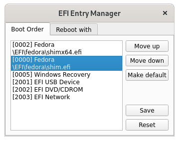
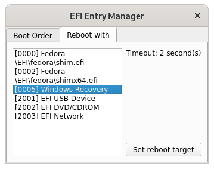

# QEFI Entry Manager

An EFI manager in Qt.

## Usage

This application needs to be run with root/sudo on Linux, or `Run as administrator` on Windows.

You can change the boot order:



or temporally set the next boot entry in this app:



click on `Yes` to reboot immediately:


## Install

First, compile and install the [QEFI]() dependency:

```
git clone https://github.com/Inokinoki/qefivar.git
cd qefivar
mkdir build && cd build
cmake ..
make install
```

Then, clone and compile this project:

```
git clone https://github.com/Inokinoki/QEFIEntryManager.git
cd QEFIEntryManager
mkdir build && cd build
cmake ..
make
```

And there will be an executable `QEFIEntryManager` in your build directory. Run it as root (*nix) or administrator (Windows).
