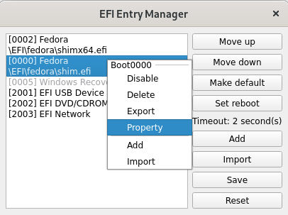

# QEFI Entry Manager

[](https://github.com/Inokinoki/QEFIEntryManager/actions/workflows/cmake-linux-amd64-appimage.yml)

[](https://github.com/Inokinoki/QEFIEntryManager/actions/workflows/cmake-windows-x86-x64.yml)

[](https://github.com/Inokinoki/QEFIEntryManager/actions/workflows/cmake-freebsd-amd64.yml)

An EFI manager in Qt.

## Usage

This application needs to be run with root/sudo on Linux, or `Run as administrator` on Windows.

You can change the boot order, add/import new boot entry, or temporally set the next boot entry in this app:



click on `Yes` to reboot immediately:


Right click on the boot entry to enable/disable/delete the entry, or show the detailed properties.

## Install
### Arch Linux
#### AUR
- Stable version

```shell
[yay/paru] -S qefientrymanager
```

- Latest git version

```shell
[yay/paru] -S qefientrymanager-git
```

#### archlinuxcn
- Stable version

```shell
sudo pacman -S qefientrymanager
```

- Latest git version

```shell
sudo pacman -S qefientrymanager-git
```

### Other Linux Distros & Windows
Download the prebuilt app from [release](https://github.com/Inokinoki/QEFIEntryManager/releases) or from CI:

- [Linux AppImages from CI](https://github.com/Inokinoki/QEFIEntryManager/actions/workflows/cmake-linux-amd64-appimage.yml)
- [Windows from CI](https://github.com/Inokinoki/QEFIEntryManager/actions/workflows/cmake-windows-x86-x64.yml)

Run it as root (*nix):

```
sudo -E ./<executable>
```

or administrator on Windows(right click).

## Build from scratch

Clone and compile this project:

```
git clone --recursive https://github.com/Inokinoki/QEFIEntryManager.git
cd QEFIEntryManager
mkdir build && cd build
cmake ..
make
```

And there will be an executable `QEFIEntryManager` in your build directory. Run it as root (*nix) or administrator (Windows).
